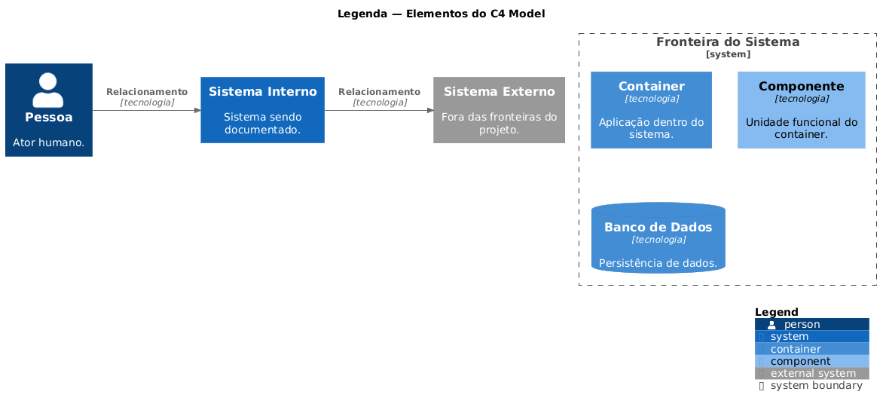
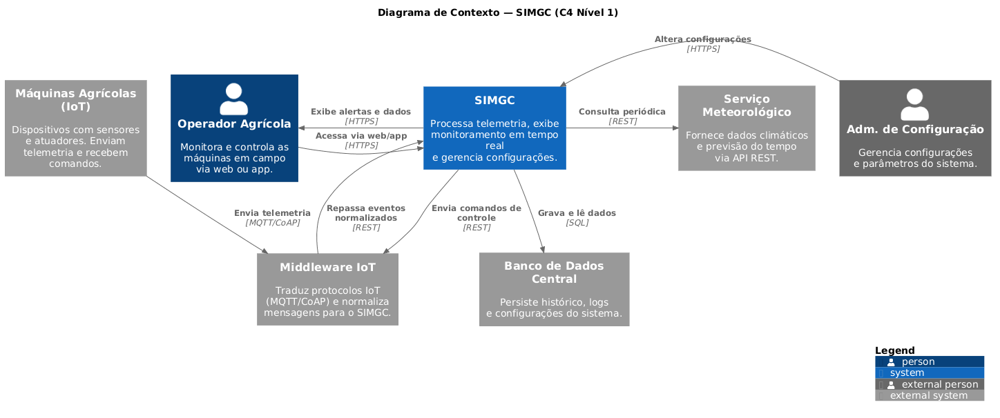
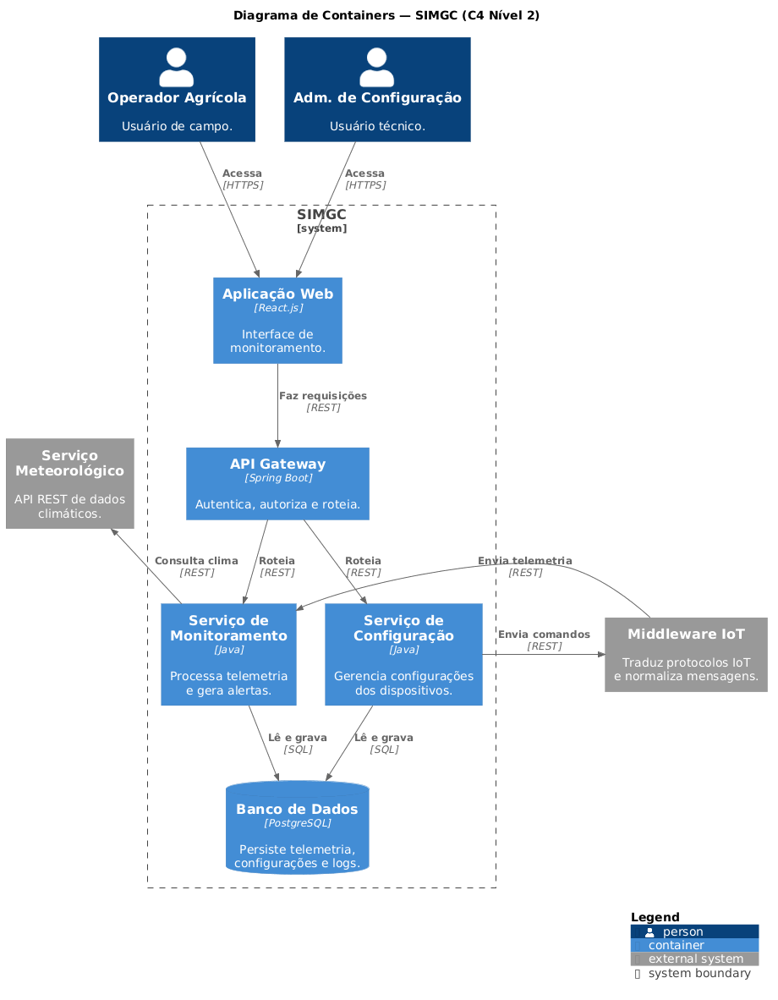
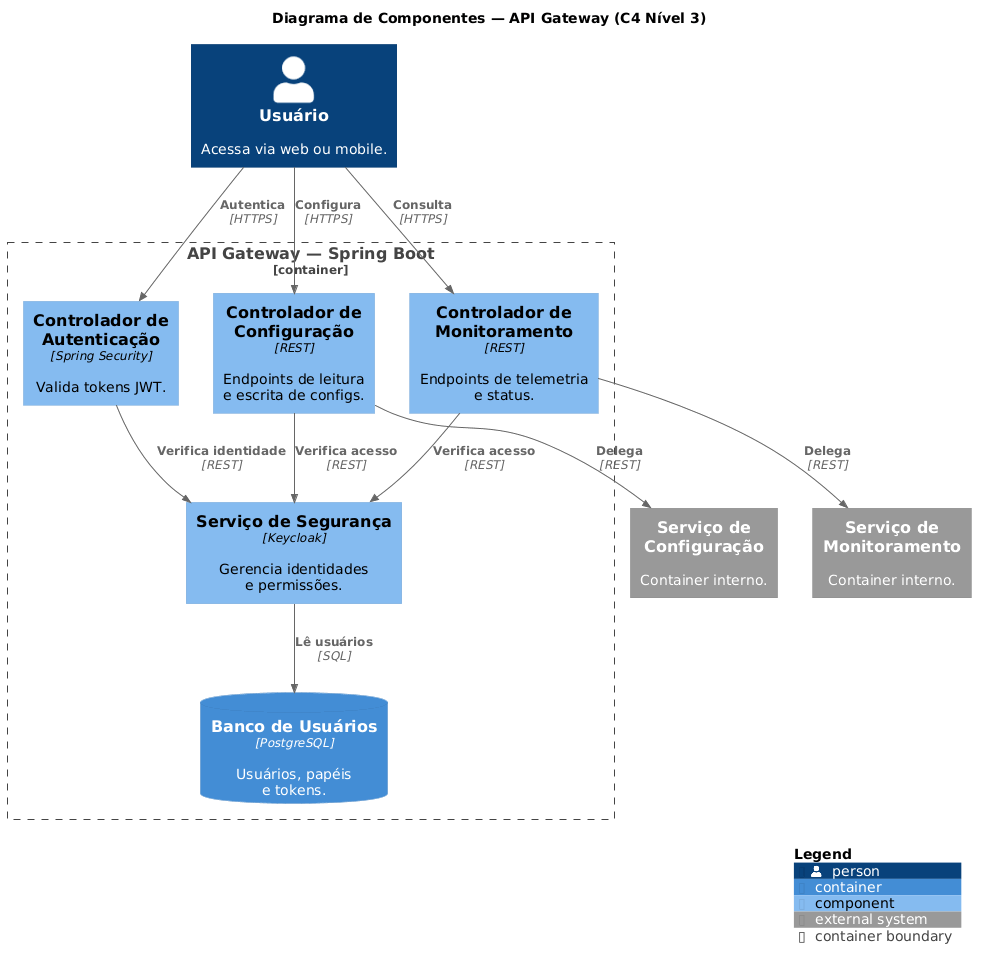
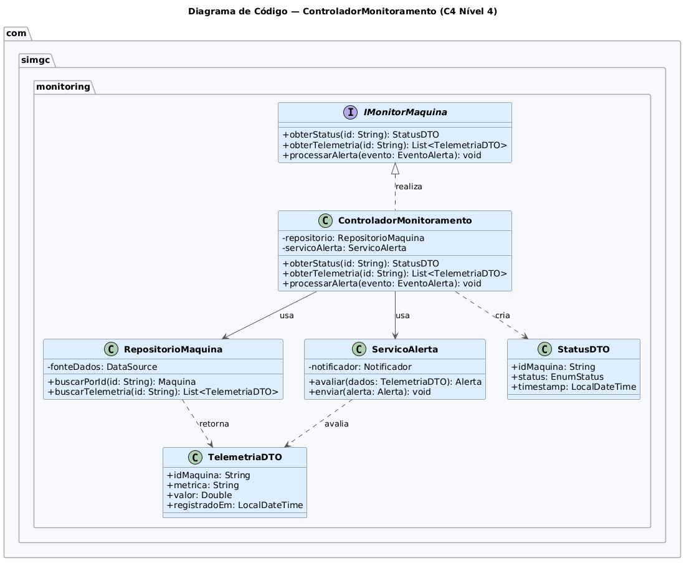

# C4 Model — SIMGC
## Sistema Integrado de Monitoramento e Gestão de Configuração para Máquinas Agrícolas

---

## 1. Objetivo do documento

Este documento descreve a arquitetura do SIMGC utilizando o C4 Model proposto por Simon Brown. O modelo organiza a documentação em quatro níveis de abstração progressivos: Contexto, Containers, Componentes e Código.

---

## 2. Descrição do sistema

O SIMGC é um sistema de software responsável por:

- monitorar em tempo real o desempenho e a saúde de máquinas agrícolas equipadas com sensores IoT;
- permitir o gerenciamento remoto de configurações dos dispositivos dessas máquinas;
- integrar dados externos, como informações climáticas, para apoiar decisões de manutenção preventiva e operação.

O sistema é acessado via interface web e aplicativo móvel por usuários humanos, e se comunica com sistemas externos para receber dados e enviar comandos.

---

## 3. Legenda

O diagrama abaixo define os tipos de elementos utilizados em todos os níveis do C4 Model neste documento.

| Elemento | Cor | Descrição |
|---|---|---|
| Person | Azul escuro | Ator humano que interage com o sistema. |
| Software System (interno) | Azul escuro | O sistema sendo documentado. |
| Software System (externo) | Cinza | Sistema de terceiros fora das fronteiras do SIMGC. |
| Container | Azul médio | Aplicação ou banco de dados dentro do sistema. |
| Component | Azul claro | Unidade funcional dentro de um container. |
| Database | Verde | Container de persistência de dados. |
| Relationship | Seta tracejada | Relação de comunicação entre elementos, com tecnologia indicada. |

---

## 4. Nível 1 — Diagrama de Contexto

O Diagrama de Contexto mostra o SIMGC como uma caixa preta no centro, identificando os atores humanos que o utilizam e os sistemas externos com os quais ele se comunica. O objetivo deste nível é responder: quem usa o sistema e com o que ele se integra?

### 4.1 Atores humanos

| Ator | Tipo | Descrição |
|---|---|---|
| Operador Agrícola | Pessoa | Usuário de campo que acessa o sistema para monitorar o estado das máquinas e receber alertas operacionais em tempo real. Utiliza a interface web ou o aplicativo móvel. |
| Administrador de Configuração | Pessoa | Usuário técnico responsável por definir, alterar e acompanhar as configurações dos dispositivos e sistemas das máquinas. Tem acesso privilegiado ao painel de gestão. |

### 4.2 Sistemas externos

| Sistema | Tipo | Descrição |
|---|---|---|
| Máquinas Agrícolas (IoT) | Sistema externo | Conjunto de máquinas equipadas com sensores e atuadores. Enviam telemetria via MQTT e recebem comandos de controle. |
| Serviço Meteorológico | Sistema externo | API REST de terceiros que fornece dados climáticos e previsão do tempo consultada periodicamente pelo SIMGC. |
| Banco de Dados Central | Sistema externo | Responsável pela persistência de histórico de telemetria, logs de operação, configurações aplicadas e registros de alertas. |
| Middleware IoT | Sistema externo | Camada de intermediação que traduz protocolos IoT nativos (MQTT, CoAP) e normaliza mensagens antes de enviá-las ao SIMGC. |

### 4.3 Fronteiras do sistema

O SIMGC é responsável por receber, processar e exibir dados de telemetria, disponibilizar interfaces de monitoramento em tempo real, permitir que usuários alterem configurações dos dispositivos, consultar dados meteorológicos externos e acionar a persistência dos dados.

O SIMGC não é responsável por gerenciar protocolos IoT (responsabilidade do Middleware), armazenar fisicamente os dados (responsabilidade do Banco de Dados), coletar dados climáticos (responsabilidade do Serviço Meteorológico) nem controlar diretamente o hardware das máquinas.

---

## 5. Nível 2 — Diagrama de Containers

O Diagrama de Containers abre o SIMGC e mostra as aplicações e bancos de dados que o compõem, com as tecnologias utilizadas em cada um e as responsabilidades de cada container.

| Container | Tecnologia | Responsabilidade |
|---|---|---|
| Web App | React.js | Interface de monitoramento acessada via navegador. Exibe dashboards, alertas e permite interações de configuração. |
| Mobile App | React Native | Aplicativo móvel para uso em campo. Mesmas funcionalidades da Web App, otimizado para dispositivos móveis. |
| API Gateway | Spring Boot | Ponto único de entrada para todas as requisições. Realiza autenticação, autorização e roteamento para os serviços internos. |
| Serv. Monitoramento | Java | Processa e armazena dados de telemetria recebidos do Middleware IoT. Gera alertas quando thresholds são violados. |
| Serv. Configuração | Java | Gerencia o ciclo de vida das configurações dos dispositivos: criação, atualização, versionamento e envio de comandos. |
| Banco de Dados | PostgreSQL | Persiste histórico de telemetria, configurações aplicadas e logs de operação. |

---

## 6. Nível 3 — Diagrama de Componentes

O Diagrama de Componentes detalha o interior do container API Gateway, mostrando os componentes que o formam, suas responsabilidades e as relações entre eles e com os containers externos.

| Componente | Tecnologia | Responsabilidade |
|---|---|---|
| Auth Controller | Spring Security | Ponto de entrada para autenticação. Recebe credenciais, emite e valida tokens JWT. |
| Monitoring Controller | REST | Expõe os endpoints de consulta de telemetria e status das máquinas. |
| Config Controller | REST | Expõe os endpoints de leitura e escrita de configurações dos dispositivos. |
| Security Service | Keycloak | Gerencia identidades, papéis e políticas de acesso. É consultado pelo Auth Controller para verificação de permissões. |
| User DB | PostgreSQL | Armazena usuários, papéis e tokens de sessão utilizados pelo Security Service. |

---

## 7. Nível 4 — Diagrama de Código

O Diagrama de Código mostra o diagrama de classes UML do componente `MonitoringController`, detalhando atributos, métodos e relacionamentos com as demais classes do pacote `com.simgc.monitoring`.

### 7.1 Descrição das classes

**IMachineMonitor** — interface que define o contrato de monitoramento. O `MonitoringController` realiza esta interface, garantindo que futuras implementações sigam o mesmo contrato.

**MonitoringController** — classe principal do componente. Depende do `MachineRepository` para acesso a dados e do `AlertService` para avaliação e envio de alertas. Retorna instâncias de `StatusDTO` para os consumers da API.

**MachineRepository** — responsável pelo acesso ao banco de dados. Encapsula as queries de leitura de máquinas e telemetria.

**AlertService** — avalia os dados de telemetria contra os thresholds configurados e aciona o envio de notificações quando necessário.

**StatusDTO** — objeto de transferência de dados que encapsula o estado atual de uma máquina para ser retornado nas respostas da API.

---

## 8. Fluxos de informação

| De | Para | Descrição | Tipo |
|---|---|---|---|
| Operador Agrícola | SIMGC | Acessa o sistema via web ou app para visualizar status e interagir com o painel. | Síncrono (HTTPS) |
| SIMGC | Operador Agrícola | Exibe dados de telemetria, status das máquinas e alertas em tempo real. | Síncrono |
| Administrador | SIMGC | Envia requisições de alteração de configuração e consulta logs de auditoria. | Síncrono (HTTPS) |
| Máquinas (IoT) | Middleware | Publicam mensagens de telemetria nos protocolos nativos. | Assíncrono (MQTT) |
| Middleware | SIMGC | Repassa dados de telemetria normalizados para processamento. | Assíncrono |
| SIMGC | Middleware | Publica comandos de configuração e controle destinados às máquinas. | Assíncrono |
| SIMGC | Serviço Meteorológico | Realiza chamadas periódicas para obter dados climáticos. | Síncrono (polling REST) |
| SIMGC | Banco de Dados | Persiste telemetria, configurações e logs; lê dados históricos. | Síncrono (SQL) |

---

## 9. Decisões de projeto

**DEC-01 — Uso do Middleware como camada de tradução de protocolos**
As máquinas agrícolas utilizam protocolos IoT como MQTT e CoAP, que não são nativamente suportados pelo sistema central. A introdução de um middleware responsável pela tradução e normalização de mensagens isola essa complexidade do núcleo do SIMGC, tornando o sistema central agnóstico ao protocolo de comunicação dos dispositivos. Isso facilita a adição futura de novos tipos de máquinas sem alterar o sistema principal.

**DEC-02 — API Gateway como único ponto de entrada**
Todos os containers internos do SIMGC são acessados exclusivamente através do API Gateway. Essa decisão centraliza autenticação, autorização e roteamento, eliminando a necessidade de lógica de segurança duplicada em cada serviço. O tradeoff é a introdução de um ponto único de falha, mitigado por estratégias de alta disponibilidade no deployment.

**DEC-03 — Consulta periódica ao Serviço Meteorológico (polling)**
A integração com dados climáticos é feita por polling periódico do SIMGC à API do serviço externo. Essa escolha simplifica a integração com provedores externos que não suportam notificações em tempo real, e é suficiente dado que previsões climáticas não exigem atualização por segundo.

---

## 10. Referências

- BROWN, Simon. *The C4 model for visualising software architecture*. Disponível em: https://c4model.com. Acesso em: abr. 2026.
- FOWLER, Martin. *Patterns of Enterprise Application Architecture*. Addison-Wesley, 2002.
- RICHARDSON, Chris. *Microservices Patterns*. Manning, 2018.
- GAMMA, Erich et al. *Design Patterns: Elements of Reusable Object-Oriented Software*. Addison-Wesley, 1994.
